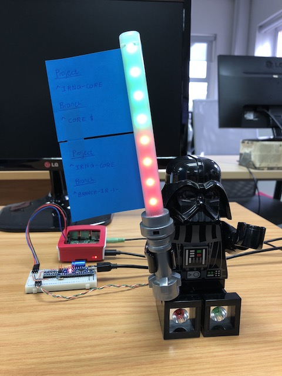

# LED Build Indicator
Infinitely extensible Raspberry Pi-based build status indicator for teams using **Atlassian's Bamboo** for continuous integration/deployment.

[](images/darth.jpg)

## What is it?
A device (and software behind the scenes) that keeps teams up to date on the status of various builds.
Multiple projects and branches can be tracked, and an addressable RGB LED strip will flash/animate to indicate when things change; speaker output can utilise text-to-speech to communicate further information.

## How it works
A collector periodically polls Bamboo's APIs to check for new builds, and utilises MQTT messages to notify any Raspberry Pi listeners of these changes. The Pis receive the data, and if relevant to the projects/branches they're interested in, they will flash/animate the RGB LEDs and play a sound/speak.

## Hardware
* (Optional) server to run the collector script to poll Bamboo data and publish build change messages. This can be run directly on the..
* Raspberry Pi - receives build change messages, and sends RGB LED/audio data to an..
* Arduino Nano - Receives RGB LED data from the Pi and drives an..
* Addressable RGB LED strip, featuring WS2812B RGB LEDs
* Audio speaker - connects to the Pi's standard 3.5mm audio jack

The LED strip is driven by an Arduino Nano due to the fast data rates required by the LEDs, with the Pi sending LED commands to the Arduino via TTL serial on the GPIO port, making use of the [Glediator protocol](https://metalab.at/wiki/Blinkenschild). The speaker will speak out relevant actions using text-to-speech.

### Schematic


## Installation

### Prerequisites

### Raspberry Pi OS

We used NOOBS OS Installer on 16GB Class 10 SD cards.
[OS download](https://www.raspberrypi.org/downloads/)
Download and follow instructions.

### Install updates
```
sudo apt update

sudo apt full-upgrade -y
```

### Settings on the Raspberry Pi

Once the operating system is set up, open the command Terminal. Type
```
sudo raspi-config
```
Go to Interfacing Options, SSH, Enable SSH.

Go to Interfacing Options, Serial, disable login shell, enable serial port hardware.

Finish and reboot.

#### Node.js

Install Node Version Manager if you want to easily install a specific version and be able to switch between versions:
[NVM](https://github.com/creationix/nvm#install-script)

Terminal:
```
curl -o- https://raw.githubusercontent.com/creationix/nvm/v0.33.11/install.sh | bash
```
Restart terminal.

We used Node.js version 6.12.2 (also installs NPM)
```
nvm install 6.12.2
```
Alternative guide for installing node.js by [this DaveJ](http://thisdavej.com/beginners-guide-to-installing-node-js-on-a-raspberry-pi).

Install [nodemon](https://nodemon.io/):
```
npm install -g nodemon
```

#### Mosquitto

Install the Mosquitto MQQT broker on your Raspberry Pi or external server - [see here](https://learn.adafruit.com/diy-esp8266-home-security-with-lua-and-mqtt/configuring-mqtt-on-the-raspberry-pi). This should be set up securely with appropriate auth.
```
sudo apt-get update
sudo apt-get upgrade
sudo apt-get dist-upgrade
sudo apt-get install mosquitto mosquitto-clients
```

#### pico2wave

[Install pico2wave](https://elinux.org/RPi_Text_to_Speech_(Speech_Synthesis)) on the Raspberry Pi for speech synthesis.

Install the supporting packages, then install Pico Text to Speech.

### SoX
Install SoX package.
```
sudo apt-get install sox libsox-fmt-all
```

### Screen
Install Screen.
```
sudo apt-get install screen
```

#### Arduino

Install the Glediator protocol receiver on the Arduino - our instructions are available [here](arduino/).

### Build Indicator

Clone this repo and navigate to the `pi_mqtt_listener`, `pi_rest_ledandsound` anf `collector_mqtt` directories respectively; within each, run the following to install required Node packages:
```
npm install
```
Note that `collector_mqtt` can instead be installed and run on another server or device instead of the Pi.

## Configuration

### Software

* `collector_mqtt/config.json` - Enter your MQTT broker and Bamboo server addresses, and the user/pass combo that should be used to access Bamboo via BASIC authentication. The poll interval (in seconds) specifies how frequently Bamboo will be polled.
* `pi_mqtt_listener/config.json` - Enter your MQTT broker address.

Note that the default MQTT broker address of `mqtt://localhost` works if Mosquitto is installed on the same device as that of the configuration file.
Additional LED bank and animation configuration is also provided in these configuration files.

### Project and Branch selection

Within `collector_mqtt/config.json`, there are fields for entering one or more regular expressions for project and branch matching. When build status messages are received, the project and branch values are tested with the regular expressions defined in the `config.json`, and if matched it is accepted as a message intended for said specific Raspberry Pi.  
The fields `resultKey` and `chainName`, as returned by Bamboo APIs, represent the project and branch respectively; thus, arrays `resultKeys` and `chainNames` are provided in the `config.json`.

#### Examples

(excerpts from `collector_mqtt/config.json`):

To match any project starting with `MAIN`:
```
"resultKeys":[
    "^MAIN"
]
```

To match any branch starting with `MAIN` **or** ending with `BETA`:
```
"chainNames":[
    "^MAIN",
    "BETA$"
]
```

To match a branch named `CORE` (exact):
```
"chainNames":[
    "^CORE$"
]
```

### Raspberry Pi Hardware

* [Disable the Pi's serial port console/terminal output](https://www.cube-controls.com/2015/11/02/disable-serial-port-terminal-output-on-raspbian/)
to facilitate the use of the serial port for Arduino communication.
* Configure your audio settings to output to the 3.5mm audio jack instead of the HDMI output, if used without a monitor.

## Usage

#### Optional shortcut
From the repo root, run the following command on the pi to start each of the 3 Node.js scrips in their own screen:
```
./runall.sh
```
#### Alternatively
From the repo root, run the following commands on the Pi to start up the separate Node.js scripts:
```
cd pi_rest_ledandsound/
screen -dm -S pi_rest_ledandsound nodemon app.js
```
Then again, from the repo run the following on the Pi:
```
cd pi_mqtt_listener/
screen -dm -S pi_mqtt_listener nodemon app.js
```
Finally, again from the repo run the following on either the Pi or external server (along with prerequisite configuration):
```
cd collector_mqtt/
screen -dm -S collector_mqtt nodemon app.js
```
The screen instances can be attached to by listing them with `screen -ls`, and running `screen -r <label>` for the relevant one.

### Demo

A demo script, `demo.sh`, is provided in the repo root; it uses the `mosquitto_pub` command to publish multiple MQTT mock messages which, along with the default configuration for project/branch regular expressions, provide a sweet demo! The Node.js scripts in `pi_rest_ledandsound/` and `pi_mqtt_listener/` both need to be running for this to function, as it's essentially emulating the messages that the Bamboo collector would be publishing from real build changes.

## Potential issues

Appropriate permissions should be granted to allow the execution of `pi_rest_ledandsound/tts.sh` in order for text to speech to work correctly.

## Authors

* **Joseph Rautenbach** - [joeraut](https://github.com/joeraut)
* **Johan Fouche**  - [narfiez](https://github.com/narfiez)
* **William Sykes** - [williamsykes](https://github.com/williamsykes)

Also, see the list of [contributors](https://github.com/ImpactInc/build-indicator/graphs/contributors) who participated in this project.

## Acknowledgments

* **Christiaan Witts** - [ChristianWitts](https://github.com/ChristianWitts) - API help and advice
* Werner van Rensburg - API help, hardware, and extra support!

## License

This project is licensed under the MIT License - see the [LICENSE.md](LICENSE.md) file for details

## Code of Conduct

See our [code of conduct](CODE_OF_CONDUCT.md).
